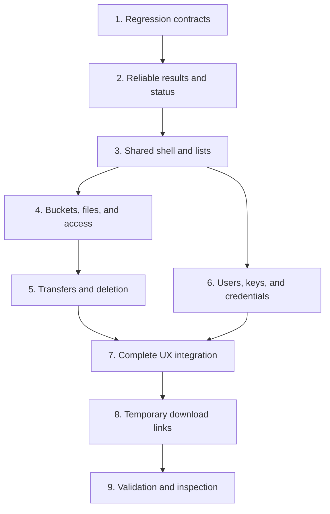

# Terminal UX and Presigned Links: Implementation Plan

## Outcome and Status

The operator selected all screen improvements from the initial review, then temporary download links.
This plan implements that scope on `feat/presigned-url` under phase `010-terminal-ux-presigned-links`.
The phase claim is commit `800c0a5`. Application baseline is `bfd15bc`.

Status: implementation and validation complete, ready for operator inspection.
The operator confirmed `/` to activate live bucket and file filtering before implementation.

Success means an operator can find a file, transfer it safely, manage access deliberately, and copy a temporary download link.
The interface must show the correct account, resource, operation state, and expiration limits.

## Approved Direction and Boundaries

- Improve every existing terminal screen and flow listed in [the UX review](ux-review.md).
- Keep Go, Bubble Tea, Lip Gloss, Cobra, and the existing Amazon Web Services (AWS) service helpers.
- Keep the current visual identity. Improve hierarchy, text, spacing, and dark/light terminal readability.
- Open a bucket into Files. Put Access and Details in separate views.
- Complete the screen improvements before implementing temporary links.
- Use one-hour, 24-hour, seven-day, and Custom link durations. Default to one hour.
- Keep the branch name requested by the operator.

The following limits keep the work bounded:

- Filtering searches the loaded list or current folder. It does not run recursive cloud searches.
- Sharing covers one file per link. Folder archives, upload links, and batch sharing are separate work.
- Existing command-line commands remain available. A new command-line sharing command is outside this phase.
- Do not add a database, link history service, account switcher, or new UI framework.
- Do not automatically change existing public policies or retire access keys.
- Do not migrate the multipart transfer manager or upgrade unrelated dependencies.
- Use service mocks and disposable local files during development. Live resource changes require an explicit manual test scope.

## Interaction Contract

### Application Shell

Use a persistent, compact header with the account, profile, region, and current location.
Show `default` when the SDK profile argument is empty, without claiming it proves which credential source won resolution.
Show a clear unknown state for unavailable context.

Use a content viewport between the header and a short footer.
Show the current selection and operation status without repeating bucket metadata above each dialog.
Use words as well as color for success, warning, error, loading, and cancellation.

| Control | Behavior |
|---|---|
| `b`, `u` | Open Buckets or Managed users when no form or protected task owns input. |
| Enter / Right | Open the selected bucket or folder; activate the explicitly named form action. |
| Left / Escape | Return one level. Escape first closes the active filter or dialog. |
| Tab | Switch Files, Access, and Details when no form is active; move between fields inside a form. |
| `r` | Refresh the active list or resource. Never create credentials. |
| `/` | Activate live name filtering. Each character updates results immediately; Enter keeps results, Escape clears the filter. |
| Space | Toggle the focused file or folder in the selection. |
| `a` in Files | Select all displayed results, or clear the current selection. |
| `n` in Files | Create a folder in the displayed destination. |
| `p`, `U`, `g` | Upload a local file, upload from a URL, or download a file. |
| `s` in Files | Share the focused file after the link milestone is complete. |
| `m` | Show context actions. This keeps the main footer short. |
| `?` | Show complete help for the current context. |
| `q` | Quit, with a decision when a task or unsaved secret needs attention. |

Global shortcuts do not steal characters from text inputs or filters.
Confirmations and pickers own their keys before global navigation.
Enter never changes public access or advances a permission without an explicit action label.

During transfers or destructive operations, Escape and Control-C request cancellation and wait for completion.
Quit offers Stay or Cancel and quit. It does not abandon an active worker.
Cancellation reports completed work and any cleanup failure. It never implies that deleted objects were restored.

### Lists and Terminal Sizes

- Support full workflows at 80 columns by 24 lines and 120 columns by 40 lines.
- Use a compact layout at 60 columns by 15 lines.
- Below 60 columns or 12 lines, show a resize notice and preserve the current state until the window grows.
- Measure header, status, and footer first. Give each list only the remaining height.
- Scroll users, permissions, folders, keys, pickers, help, confirmations, and long link displays.
- Hide secondary columns before shortening names. Keep the complete selected name/path available in the content area.
- Use terminal-column-aware width and truncation. Never cut a UTF-8 byte sequence or an escape sequence.
- Keep a text focus marker in addition to selection color. Test light and dark terminal backgrounds.

Filtering is case-insensitive substring matching over loaded entries.
It covers bucket names and all file/folder names in the current folder, including entries beyond the first listing page.
Filtering makes no cloud request per keystroke. Show the query and matching count.
Changing the filter clears selection and clamps the cursor. Select all refers to the displayed results.
Refresh preserves the focused object by key and reconciles selections against the refreshed listing.
Folder navigation clears selection but restores the parent's cursor and scroll position when returning.
Object keys and action targets always use full source values, never rendered or filtered labels.

## Architecture and Ownership

This is a targeted refactor of the existing model structure, not a replacement application.

1. Keep `App` as the root keyboard/router model. Route asynchronous results by their owner, independently of the visible screen.
2. Give each read or mutation a request identifier and resource identity: bucket, prefix, username, or object key.
3. Include identity on success, failure, and progress messages. Ignore obsolete results without clearing a newer operation.
4. Use typed status outcomes. Clear an error only when its matching retry succeeds or the operator dismisses it.
5. Keep confirmed service data separate from a pending form choice. Apply changes after success.
6. Add a small shared list-state helper for cursor, offset, paging, filtering, and resize clamping.
7. Add a shared shell/layout helper and context key descriptions. Render footer and help from the same action definitions.
8. Split large terminal files along existing behavior boundaries as each milestone needs them. Avoid a general component framework.
9. Reuse AWS interface mocks. Add narrow seams for clipboard writing, time, presigning, and file publication where tests need them.

Suggested terminal file boundaries are `layout.go`, `list.go`, `status.go`, `browse.go`, `transfer.go`, `permissions.go`, `keys.go`, and `share.go`.
Names are routine implementation choices. Behavior and ownership are the contract.

Use the existing `github.com/charmbracelet/x/ansi` module for safe width, truncation, and wrapping.
It already exists in the dependency graph. Promote it to a direct dependency only if imported directly.
No new third-party library is planned.

AWS metadata must represent unknown or partial results explicitly.
Do not infer verified public readability from public-access-block settings alone.
Use labels such as Public access blocked, Public access allowed, and Unknown, with scope explained in Access.
Treat unavailable statistics and unavailable key counts separately from zero.
Surface partial user-list failures instead of silently excluding users whose tags could not be read.

Shared service changes must preserve existing command names, flags, and JSON fields.
Add status fields where required; document and test additive metadata. Command-line text must not keep printing a false public/private certainty.

## Dependency Graph



The root agent owns requirements, shared contracts, integration, and final verification.
After milestone 3, bucket/transfer work and user/credential work can proceed independently.
Serialize changes to `app.go`, `buckets.go`, `client.go`, shared models, and shared tests.
Do not let concurrent agents edit the same file or mutate the Git index.
Do not start independent branch review before operator acceptance in Normal mode.

## Milestones and Completion Criteria

### 1. Establish Regression Contracts

Record the current passing baseline. Promote the audit's demonstrated failures into durable regression tests.
Each behavior change starts with a test that fails for the reported reason.
Implement and verify each bounded slice before moving on; do not push a deliberately failing suite.

First cases include mixed root files/folders, stale bucket and folder results, results arriving after navigation,
failed permission edits, sticky errors, negative cursors on empty lists, Unicode clipping, and terminal overflow.
Retain valid selection, delete, and progress tests. Update old interaction expectations only when this plan changes the behavior.

Primary files: `internal/tui/tui_async_test.go`, focused new terminal test files, `internal/aws/s3_test.go`, and `internal/aws/iam_test.go`.
Done: each reported failure has an explicit expected outcome and a regression test in its implementation slice.

### 2. Make Operation Results Reliable

Introduce resource/request ownership and typed status. Separate result routing from keyboard routing.
Preserve background results for their model without letting an obsolete response reopen a screen or replace another resource.
Prevent duplicate permission submissions and other conflicting mutations.
Make public settings, statistics, key counts, and partial loads report what is known.

Primary files: `internal/tui/app.go`, result handlers in `buckets.go` and `users.go`, `internal/model/types.go`, AWS metadata helpers.
Done: stale responses, unrelated errors, and navigation cannot produce misleading resource or permission state.

### 3. Build the Shared Shell and List Behavior

Implement context, sizing, scrolling, filtering, safe text measurement, consistent focus, and contextual help.
Give forms, pickers, confirmations, and protected operations clear input priority.
Keep empty, loading, denied, failure, and no-match states actionable.

Primary files: shared terminal helpers and `styles.go`, integrated through the root and screen models.
Done: common behavior works in table-driven fixtures at all three supported window sizes, including resize during a dialog.

### 4. Rework Buckets, Files, and Access

- Bucket list: filterable, compact, explicit metadata state, and meaningful empty/loading views.
- Create bucket: show name and region, validate input, preserve failed input, and report partial creation accurately.
- Files: always call the existing paginated `ListContents` for root files and folders together.
- Navigation: Enter opens folders; Back restores parent position. Refresh preserves focus.
- New folder: one flow with the full destination, duplicate handling, and navigation after successful creation.
- Selection: show count and scope. Confirm bulk actions against the selected keys, not a moving cursor.
- Access: separate public settings and assigned users. Show affected bucket/prefix and current/requested state before Apply.
- Details: show region, creation date, and available dated statistics without crowding Files.
- Preserve `--bucket` support and useful file operations when IAM listing is denied.

Primary files: `buckets.go`, new browser/access helpers, existing AWS listing/access helpers, related tests.
Done: all bucket and folder tasks remain reachable in empty, mixed-content, restricted-access, and long-list fixtures.

### 5. Make Transfers and Deletion Safe

Local picker: dedicated content area, path entry, current-folder filter, hidden-file toggle, destination preview,
scrolling, and actionable directory errors. A failed directory load must not leave stale entries selectable.

Download: show/edit the destination. Ask Rename, Overwrite, or Cancel when needed.
Download into a temporary file in the destination directory. Publish only complete output.
Recheck conflicts at publication. Failure/cancellation preserves prior content and removes incomplete output.
Use a platform-aware publication method and test conflicts arising during the transfer.

Local and URL upload: show the destination and ask before replacing an existing object.
For URL uploads, resolve the filename first, then review a conflict before uploading.
Preserve source and destination on failure. Label the optional input Destination filename or path.
Treat denied existence checks as unknown, not as proof that no object exists.
Use SDK conditional writes where supported to catch a destination changing after confirmation.
The installed multipart manager copies input conditions into multipart completion; test both single and multipart paths.

Progress: reuse the existing counters. Standardize Escape and Control-C cancellation and show cancelling until acknowledged.
Attempt multipart cleanup with a bounded uncancelled cleanup context when needed. Report cleanup failure without claiming success.

Delete: consolidate repeated bucket prompts into one target/scope review with a strong typed confirmation for recursive deletion.
Capture targets before confirmation. Use version-aware wording and the current helper's actual behavior.
Retain cancellation and actual completed counts, and distinguish deletion failure from public-policy cleanup failure.
Do not broaden deletion to previously unhandled versions or resources without a separate product decision.

Primary files: transfer/picker helpers, `urlupload.go`, `internal/aws/s3.go`, `internal/httpcopy/copy.go`, and their tests.
Done: rejected actions make no mutation call; failed or cancelled replacements preserve prior content where the operation permits it.

### 6. Improve Users, Permissions, Keys, and Credentials

Managed users and pickers: filterable, scrollable lists, explicit partial metadata, consistent refresh, and preserved focus.

Create user: Name, Bucket, Permission, Review, then Create. Back preserves previous choices.
Explain Read, Read and upload, and Read, upload, and delete. Show the chosen resource and rights before creation.
If a service step fails after creating a user, report the partial result and a deliberate recovery path.
Do not retry a multi-step mutation blindly or remove an existing user as automatic cleanup.

Permissions: an explicit picker and Apply review in both user-side and bucket-side flows.
Cancel makes no service change. Failure keeps the confirmed old permissions and allows retry.
Refresh after success so both entry points agree.

Keys: add a guided key-management view. List key ID, date, and status without secrets.
The existing RotateAccessKey helper only creates a key, so label that action Create new key.
Check the two-key limit and explain that the previous key remains active.
The guided flow is Create, Save/copy secret, Update dependent applications, then explicitly deactivate the old key.
Add `UpdateAccessKey` support for reversible deactivation/reactivation.
Offer separate typed confirmation to delete an inactive key after the operator verifies its replacement.
Never auto-retire keys, never choose an old key implicitly, and do not claim to verify external applications.
Warn if the selected retirement target is the current session's credential when that identity is available.

Credentials: show the username and masked secret, with explicit Reveal, Copy, Save, and Done actions.
Copy failure retains access to the secret. Show a destination path before saving.
Use a key-specific filename, exclusive creation, and owner-only permissions. Existing files stay unchanged by default.
Ask before leaving without saving or explicitly acknowledging that the secret was captured.
Clear the model's secret when leaving, without claiming secure memory erasure.

Primary files: `users.go`, key/credential helpers, `internal/aws/iam.go`, `client.go`, shared models, and focused tests.
Done: create/edit/save/retire flows have no accidental mutation, false success, or silent credential overwrite.

### 7. Integrate Every UX Improvement

Walk every screen and action with deterministic sample data.
Use empty, typical, 50-entry, paginated, long-path, Unicode, permission-denied, and failed-operation cases.
Check dark and light terminal backgrounds in the same bounded inspection pass.
Fix observed issues together, then do one confirmation pass.
Update README shortcut and workflow documentation and the phase coverage matrix.

Done: the screen coverage below is complete. This precedes temporary-link implementation.

### 8. Add Temporary Download Links

Use the existing AWS SDK for Go v2 presigner, created from the configured S3 client.
Add a narrow injectable presigning interface and a structured result containing URL, requested duration,
effective duration, signing time, expiry time, and any known credential limit.
Preserve bucket region and endpoint configuration.

Retrieve credentials once for each generation request. Use that same snapshot for signing and expiration calculations.
Refresh through the configured provider before obtaining the snapshot. Do not expose its keys or token in logs or model display.
Compute the displayed signing expiry from the actual signing timestamp and lifetime, rounded safely to whole seconds.

Duration behavior:

- Presets: one hour, 24 hours, seven days, Custom. Default: one hour.
- Custom accepts a positive whole number with minutes, hours, or days, such as `30m`, `2h`, or `3d`.
- Product range: one minute through seven days. Reject empty, zero, negative, malformed, overflowing, and excessive input.
- Known earlier credential expiry: show the limit and offer Use available session time or Cancel. Never silently shorten the selection.
- Expired or near-expired credentials: explain that credentials need renewal. Do not generate a practically expired link.
- If a temporary token has no known expiry, explain that session expiry can end access sooner. Do not fabricate a limit.
- Bucket policy and credential revocation can end access earlier. Use Ends no later than for the displayed expiry.

Terminal flow: selected file -> Share -> choose duration -> review any session limit -> Generate and copy -> result.
Show the full object path, expiration date/time/timezone, and concise download-access help.
Generate only for the focused file. With a bulk selection, make the focused-file scope explicit.
Do not offer file-link generation for folders.

Clipboard failure preserves the generated URL. Offer Copy again and a scrollable Show link view with the complete URL.
Copy again reuses the same URL and expiration. Expired results offer explicit regeneration.
Changing duration creates a new link from the new generation time. It does not edit or revoke the previous link.
Discard link display data when the result is closed, without writing a history file.
Signing or copying never changes bucket policies. Explain when an existing public grant can leave the file reachable separately.

Primary files: `internal/aws/presign.go`, AWS client setup, `internal/tui/share.go`, browser action wiring, and focused tests.
Done: private-file signing, duration validation, credential limits, region handling, copy retry, and safe return to the selected file all pass.

### 9. Validate, Document, and Present

Run focused tests during each milestone, then the full required checks once the integrated behavior is ready.
Update README and root CHANGELOG with user-visible behavior and changed shortcuts.
Phase claims and internal planning alone do not need release notes.
Record completed checks, remaining limits, and representative terminal captures in this phase folder.
Use fake data and fake signed-link credentials for shared captures.

Commit and push completed work on `feat/presigned-url` for inspection.
In Normal mode, stop for operator acceptance before independent branch review and a pull request.
After acceptance, run the required independent review, fix verified blocking findings, rerun relevant checks, and open the pull request.
Do not merge or release.

## Screen Coverage Matrix

| Screen or flow | Milestones | Required acceptance evidence |
|---|---|---|
| Startup and global navigation | 2, 3 | Account/profile visible; focused forms retain shortcut letters; background results reach their owner. |
| Bucket list and create | 3, 4 | Filter, compact columns, region preview, name validation, retry, explicit metadata state. |
| Files, empty root, and mixed root | 4 | Root files and folders coexist; empty state offers upload/new folder; all pages reachable. |
| Folder navigation and creation | 4 | Enter opens; Back restores parent focus; duplicates and failed creation preserve context. |
| File selection and filtering | 3, 4 | Visible selection count; select all uses displayed results; actions retain full keys. |
| Public settings and assigned users | 2, 4, 6 | Access is separate; unknown is explicit; changes require review; denied IAM does not block Files. |
| Bucket metadata | 2, 4 | Zero differs from unavailable; statistics show freshness; long data fits. |
| Local file picker | 3, 5 | Scroll/filter/path entry/hidden toggle work; destination is clear; stale entries cannot upload. |
| Local and URL upload | 5 | Source/destination review, replacement decision, retry preservation, progress, cancellation, cleanup outcomes. |
| Download | 5 | Existing file survives reject/failure/cancel; complete output appears only on success; race conflicts handled. |
| File/folder/bulk/bucket deletion | 4, 5 | Captured targets, accurate scope, strong recursive confirmation, partial counts, cancellation. |
| Managed users and all pickers | 2, 3, 6 | Search/paging/refresh, partial metadata, preserved focus, actionable denied/empty states. |
| Create user and permission editing | 6 | Back preserves choices; final review; cancel does not mutate; failed edits preserve confirmed rights. |
| Key creation and retirement | 6 | Two-key limit, saved new secret, explicit old-key deactivation, separate deletion, failure recovery. |
| Credential reveal/copy/save/exit | 6 | Masking, copy retry, private exclusive save, no overwrite, unsaved-exit decision. |
| Help and all status views | 2, 3, 7 | Context matches controls; no hidden actions; errors clear on matching recovery; warnings remain visible. |
| Temporary download links | 8 | Correct file/region/duration/expiry; credential limits; failed copy retry; no public-policy mutation. |

## Verification Strategy

Use automated behavior tests before implementation for each bug and interaction change.
Test user outcomes and service calls, not private implementation details or every rendering string.
Pure copy, documentation, and palette adjustments use rendered inspection where behavioral tests add no value.

Critical regression groups:

1. **Routing:** resource identity and request order, inactive-owner completion, stale failure/progress, and direct-bucket cancellation.
2. **State:** failed permission edits, duplicate submits, matching retry, partial metadata, and partial user creation.
3. **Layout:** every screen/mode at 80x24, 120x40, and 60x15; resize, long paths, Unicode, focus and primary instructions visible.
4. **Files:** mixed root, multiple listing pages, empty filters, preserved parent focus, selection scope, and hidden local entries.
5. **Transfers:** overwrite reject/approve, destination races, partial cleanup, concurrent progress, cancel acknowledgement, conditional upload conflicts.
6. **Keys and credentials:** two-key limit, deactivate/reactivate/delete failures, no auto-retirement, save collision, file mode, copy failure, and unsaved exit.
7. **Links:** malformed/boundary duration, expiring/unknown-expiry credentials, token signing, correct region and key encoding, stale generation, copy retry.

For presigner integration tests, use the real installed signer with fake credentials and a transport that rejects any network request.
Inspect signed method, host, object path, session-token presence, and expiry query fields without logging credentials or full signed URLs.
Use an injectable clipboard writer for success/failure tests. Use temporary directories for all file tests.

Commands at implementation completion:

```sh
go test ./internal/tui ./internal/aws ./internal/httpcopy ./internal/httpresolve ./internal/progress ./cmd
make check
go test -race ./...
make build
golangci-lint run --timeout=5m
govulncheck ./...
```

The local shell currently lacks `golangci-lint` and `govulncheck`.
Install compatible development tools or rely on the existing CI jobs; report the exact checks actually run.
Cross-compile for the release targets: Linux and macOS, on amd64 and arm64.
Cross-compilation checks build compatibility; it does not replace filesystem behavior tests on each platform.
Manual terminal inspection complements the tests. The web design detector does not establish Go terminal quality.
Do not claim screen-reader validation or live AWS validation unless those checks actually ran.

## Risks and Decisions

| Risk or decision | Planned handling |
|---|---|
| Broad scope can turn into an application rewrite. | Keep the current framework and service helpers; bounded milestones and existing entry points. |
| Shared files can cause parallel-agent conflicts. | Root owns shared contracts and integration. Parallelize only independent file sets after milestone 3. |
| False access labels can mislead sharing decisions. | Describe known settings and policy scope; unknown stays unknown; do not promise proven public reachability. |
| Multi-step user creation can partially succeed. | Return/report completed steps and a deliberate recovery path. Never retry or delete blindly. |
| Key retirement can interrupt dependent applications. | Full guided flow is proposed within the selected scope; external verification remains the operator's step. |
| URL upload names are known only after resolution. | Resolve, review the destination/conflict, then upload; preserve inputs on retry. |
| Remote files can change after overwrite review. | Use conditional writes and handle conflicts as new decisions; preserve current content on denied replacement. |
| Cancellation can leave multipart storage behind. | Attempt bounded cleanup and report failure; do not silently install lifecycle policies. |
| Credential refresh can change link lifetime. | Bind signing and expiry to one retrieved snapshot; show shortening before generation. |
| Public folders remain public after signing. | Public-policy migration remains a separate operator decision. This phase does not change grants automatically. |
| Clipboard behavior differs on remote terminals. | Preserve the link/secret for explicit display and retry. Never report a copy without success. |
| Screens are source-reviewed but not yet proven live. | Render fixtures plus a bounded terminal inspection before acceptance. |

No new long-term storage or service architecture is proposed.
Operator inspection can correct the key-retirement scope, shortcuts, or defaults before implementation.

## Sources and Planning Evidence

- [Initial UX review](ux-review.md): independent design and evidence passes, five existing packages passed, and four temporary evidence checks.
- Planning inputs: `tui_design_review` configured as `gpt-6-sol` with high reasoning, and `tui_evidence_review` as `gpt-6.1-sol` with high reasoning.
- Installed SDK inspected at S3 v1.100.0, manager v1.22.16, and core AWS v1.41.6.
- [AWS presigned URL behavior](https://docs.aws.amazon.com/AmazonS3/latest/userguide/using-presigned-url.html): SDK maximum seven days; credentials and policy can shorten access.
- [AWS SDK for Go v2 S3 examples](https://docs.aws.amazon.com/sdk-for-go/v2/developer-guide/go_s3_code_examples.html): configured S3 presigner and expiration options.
- [AWS IAM access keys](https://docs.aws.amazon.com/IAM/latest/UserGuide/id_credentials_access-keys.html): two-key limit and one-time secret retrieval.
- [AWS key rotation](https://docs.aws.amazon.com/IAM/latest/UserGuide/id-credentials-access-keys-update.html): staged replacement before old-key retirement.

Planning-only verification: source/API inspection, phase collision check, document link checks, and Git whitespace checks.
No application tests were rerun for the phase claim and plan. Implementation verification remains outstanding.
